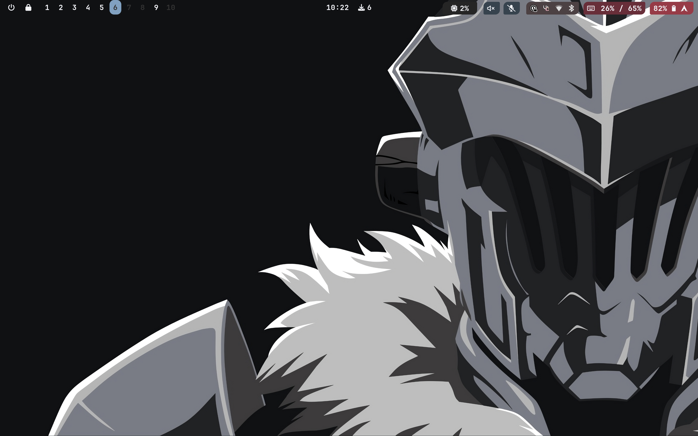

# Arch linux Hyprland dotfiles

keyboard and vim oriented config

### Config

-- tmux

-- neovim config

-- xremap to emulate vim keymap on :

    * browsers
    * vesktop (discord)
    * notiona
    * map ctrl to caps and escape to alt right

-- rofi :

    * calc
    * todo
    * tmux session open
    * clippboard \* ssh

-- kitty

-- fish

-- ranger

-- vesktop (discord)

## credit

[SolDoesTech config](https://github.com/soldoestech/hyprv4)
